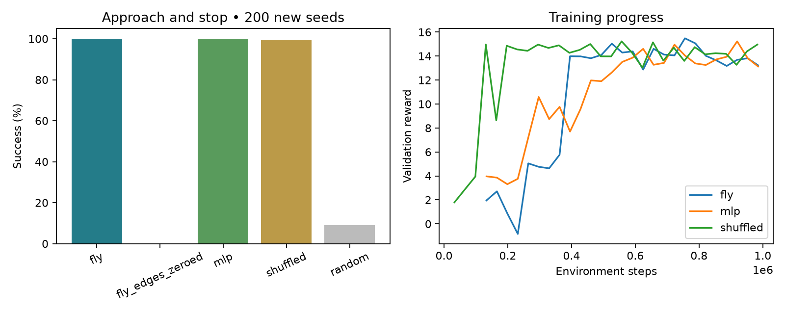

# Training results

Completed locally on Apple M2 CPU. This is a trained research prototype, not a hardware-ready dog controller.

## Navigation

Each policy received approximately one million PPO environment steps. The fly and MLP runs used a 100k pilot followed by 900k additional steps; the shuffled control used one continuous run. All used training seed 42. Models were selected by validation reward, then evaluated on the same 200 previously unused environment seeds (30000–30199). Earlier 100-episode evaluations were exploratory and informed extending training.

| Controller | Successful stops | Collisions | Mean reward | Parameters |
|---|---:|---:|---:|---:|
| fly | 200/200 | 0/200 | 13.93 | 44057 |
| fly_edges_zeroed | 0/200 | 200/200 | -12.24 | — |
| mlp | 200/200 | 0/200 | 14.12 | 965 |
| shuffled | 199/200 | 0/200 | 14.25 | 44057 |
| random | 18/200 | 64/200 | -8.18 | — |

The zeroed-edge test removes connectivity only at inference from the trained fly policy. It checks whether that policy uses its graph; it does not establish an advantage for biological topology. The shuffled control is not degree-preserving and the MLP is not parameter-matched. A single training seed cannot establish comparative superiority.

## Can detector

YOLO11n was fine-tuned for 20 epochs at 320-pixel resolution. Best weights were selected on validation data; the numbers below are from the separate test split.

- metrics/precision(B): 0.5694
- metrics/recall(B): 0.3182
- metrics/mAP50(B): 0.3480
- metrics/mAP50-95(B): 0.2097
- fitness: 0.2097

| Split | Images | Images with cans | Can boxes |
|---|---:|---:|---:|
| train | 210 | 107 | 186 |
| val | 42 | 23 | 32 |
| test | 52 | 21 | 22 |

34 selected images were excluded because their downloaded aspect ratio disagreed with annotations. Failures are recorded in the data manifest.

Detector results are preliminary: the test set is small, and outdoor litter photos differ from a robot camera indoors. Navigation training used simulated detector-like features, not this detector in the loop. End-to-end physical success has not been measured.

## FlyWire scope

The policy uses 128 real v783 neurons and 1271 directed aggregated connections representing 35,046 synapse counts before normalization. Connectivity is frozen; adapters and channel dynamics are trained. This is not the entire brain, a spiking simulation, or a biological preference-retraining result.

## Verification and artifacts

- Eight tests passed: environment contract, stopping, collisions, hidden targets, trainable adapters, graph direction/effect, camera convention, and dataset splits/label ranges.
- `artifacts.json` records checkpoint locations and SHA-256 hashes. Checkpoints and downloaded data remain locally available but are excluded from Git.
- `navigation_results.json` includes every final evaluation episode; `detector_metrics.json` records detector test metrics.
- See the README for setup, training, resuming, and offline image-to-action inference.

The repository is local. No GitHub repository has been published and no robot commands have been sent.
